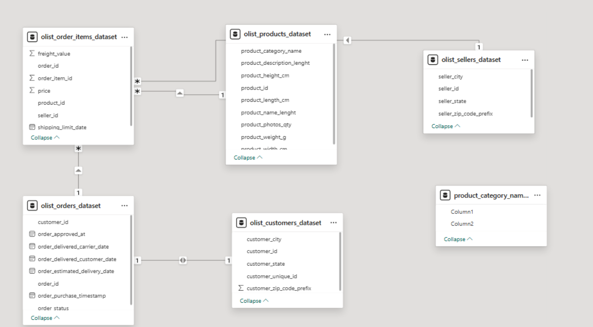
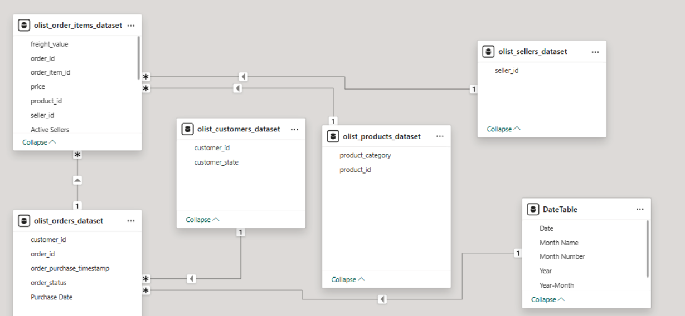
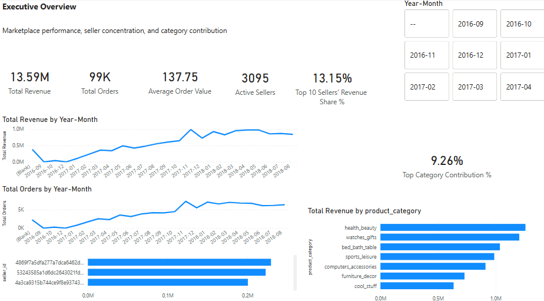
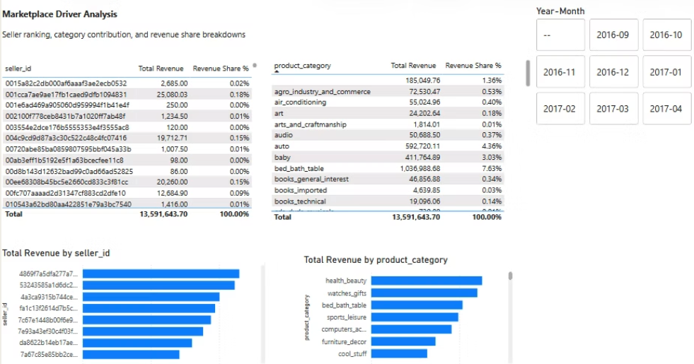

# Mapping Olist Brazilian Ecommerce Dependence

**An Interactive Dashboard Examining Seller Concentration, Category Leadership, and Revenue Activity Over Time**

**Topic**  
Marketplace Business Intelligence

**Sub-Topic**  
Marketplace Concentration and Revenue Activity Patterns

**Question**  
Is Olist’s marketplace growth broadly distributed, or meaningfully dependent on a narrow set of revenue drivers?

**Why does it matter?**  
Growth can look strong at the top line while still depending on a narrow set of sellers, categories, or activity drivers. Distinguishing between broad-based and concentrated growth matters because it changes how marketplace performance should be judged.

## Opening Context

Marketplace revenue is not shaped by demand alone. In a multi-seller ecommerce model, performance is also influenced by how broadly sellers participate, which categories lead revenue, and how activity changes over time. Using the public Olist Brazilian ecommerce dataset, this case study looks beyond topline growth to examine whether marketplace performance appears broadly distributed or meaningfully dependent on narrower revenue drivers.

## Problem Statement

The core problem was to determine whether Olist’s marketplace performance reflected broad-based growth or meaningful dependence on a narrower set of revenue drivers. To make that visible, the dashboard was designed to evaluate seller concentration, category contribution, and revenue activity patterns over time rather than relying on topline metrics alone.

## Transformation Workflow

The transformation workflow focused on converting a raw public ecommerce dataset into a usable marketplace intelligence model. Relevant tables were selected and cleaned, relationships were structured across orders, order items, products, sellers, and customers, and Portuguese category labels were translated into English for reporting clarity. A dedicated Date table was added to support time-based analysis, and DAX measures were developed for revenue, order volume, seller breadth, revenue share, and concentration metrics. The final output was organized into a two-page dashboard designed to separate executive-level performance monitoring from deeper driver analysis.

**Initial Model State**  

**Final Analytical Model**  

- Selected and narrowed the Olist tables to the entities most relevant for marketplace revenue analysis  
- Structured relationships across orders, order items, products, sellers, and customers to support seller- and category-level reporting  
- Translated Portuguese category fields into English and added a Date table to improve reporting clarity and time-based analysis  
- Developed DAX measures for revenue, order volume, contribution, and concentration, then organized the output into a two-page dashboard  

## Interactive Dashboard and Strategic Interpretation

The dashboard was built to move from topline visibility to deeper concentration analysis. The first page, **Executive Overview**, summarizes marketplace scale, activity trends, and concentration signals in one view. The second page, **Marketplace Driver Analysis**, supports closer inspection of seller and category contribution through ranking and comparison views. Together, these pages make it easier to judge whether Olist’s marketplace growth is broadly supported or increasingly shaped by narrower revenue drivers.

**Executive Overview**  

**Marketplace Driver Analysis**  

- **Executive Overview** brings together marketplace scale, concentration signals, and activity trends in a single top-level view  
- **Marketplace Driver Analysis** breaks performance down further through seller- and category-level ranking and contribution views  
- A shared **Year-Month slicer** allows both pages to shift from full-market perspective to period-specific analysis  
- Read together, the dashboard suggests that Olist’s growth is broad enough to show meaningful participation, but still shaped by visible concentration in leading sellers and categories  

## Key Insights

- **Seller concentration is meaningful, but not extreme.** The top 10 sellers contribute **13.15%** of total revenue, showing that leading sellers matter without fully dominating marketplace performance.  
- **Category leadership is visible, but revenue is not captured by a single category.** The top category contributes **9.26%** of total revenue, indicating concentration that is present but still spread across a wider category mix.  
- **Growth appears to be supported by broader activity, not only higher-value transactions.** Revenue and order trends rise together over time, suggesting marketplace expansion is linked to growing activity volume.  
- **Overall, Olist’s marketplace growth appears broad enough to show meaningful participation, but still concentrated enough that leading sellers and categories materially shape performance.**  

## Key Outcome

The key outcome of this project is a clearer and more defensible view of marketplace dependence. By moving beyond topline revenue into seller concentration, category contribution, and activity-based growth patterns, the dashboard makes it easier to judge whether Olist’s marketplace expansion is broadly supported or meaningfully dependent on narrower drivers. As a BI case study, it also demonstrates the ability to turn raw public data into a structured model, an interactive dashboard, and a business interpretation that holds together.
